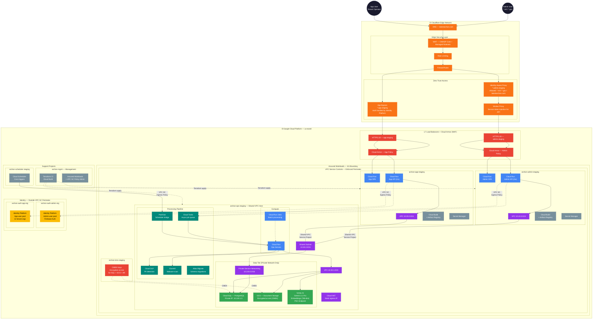

# Archon Platform — Staging System Architecture

```mermaid
flowchart TB
    %% ──────────────────────────────────────────────
    %% External Users
    %% ──────────────────────────────────────────────
    admin_user(("Admin User<br/>*.mil / *.gov"))
    app_user(("App User<br/>Tenant Operator"))

    %% ──────────────────────────────────────────────
    %% Cloudflare Edge
    %% ──────────────────────────────────────────────
    subgraph cf["① Cloudflare Edge Network"]
        direction TB
        dns["DNS — latentarchon.com"]

        subgraph cf_security["Edge Security Layer"]
            waf_cf["WAF — OWASP Core + Managed Rulesets"]
            rate["Rate Limiting"]
            fw_rules["Firewall Rules"]
        end

        subgraph cf_zt["Zero Trust Access"]
            zt_admin["Identity-Aware Proxy<br/>*.admin.staging<br/>Allowed: *.mil / *.gov / latentarchon.com"]
            zt_worker["Worker Proxy<br/>Service token injection for API"]
            zt_app["App Bypass<br/>*.app.staging<br/>Auth handled by Identity Platform"]
        end
    end

    %% ──────────────────────────────────────────────
    %% GCP — Top-level
    %% ──────────────────────────────────────────────
    subgraph gcp["② Google Cloud Platform — us-east4"]

        %% ──────────────────────────────────────────
        %% Load Balancers + Cloud Armor
        %% ──────────────────────────────────────────
        subgraph lb_tier["L7 Load Balancers + Cloud Armor (WAF)"]
            lb_admin["HTTPS LB — admin.staging"]
            armor_admin["Cloud Armor — Admin Policy"]
            lb_app["HTTPS LB — app.staging"]
            armor_app["Cloud Armor — App Policy"]
        end

        %% ──────────────────────────────────────────
        %% Assured Workloads IL5
        %% ──────────────────────────────────────────
        subgraph il5["Assured Workloads — IL5 Boundary"]

            %% ──────────────────────────────────────
            %% VPC SC Perimeter
            %% ──────────────────────────────────────
            subgraph vpcsc["VPC Service Controls — Enforced Perimeter"]

                %% Admin Project
                subgraph admin["archon-admin-staging"]
                    admin_vpc["VPC 10.10.0.0/24"]
                    admin_spa["Cloud Run<br/>Admin SPA"]
                    admin_api["Cloud Run<br/>Admin API (Go)"]
                    admin_build["Cloud Build<br/>+ Artifact Registry"]
                    admin_secrets["Secret Manager"]
                end

                %% App Project
                subgraph app["archon-app-staging"]
                    app_vpc["VPC 10.20.0.0/24"]
                    app_spa["Cloud Run<br/>App SPA"]
                    app_api["Cloud Run<br/>App API (Go)"]
                    app_build["Cloud Build<br/>+ Artifact Registry"]
                    app_secrets["Secret Manager"]
                end

                %% Ops Project
                subgraph ops["archon-ops-staging — Shared VPC Host"]
                    ops_vpc["VPC 10.30.1.0/24"]
                    shared_subnet["Shared Subnet<br/>10.30.2.0/24"]
                    nat["Cloud NAT<br/>Static egress IP"]

                    subgraph ops_compute["Compute"]
                        ops_api["Cloud Run<br/>Ops Service"]
                        ops_jobs["Cloud Run Jobs<br/>Batch processing"]
                    end

                    subgraph ops_data["Data Tier (Private Network Only)"]
                        psn["Private Service Networking<br/>10.219.0.0/16"]
                        sql["Cloud SQL — PostgreSQL<br/>Private IP: 10.219.1.3"]
                        gcs["GCS — Document Storage<br/>Encrypted at rest (CMEK)"]
                        vertex["Vertex AI<br/>Gemini 3.1 Pro<br/>Embeddings (768-dim)<br/>PSC Endpoint"]
                    end

                    subgraph ops_processing["Processing Pipeline"]
                        tasks["Cloud Tasks<br/>Async job queue"]
                        dlp["Cloud DLP<br/>PII detection"]
                        clam["ClamAV<br/>Malware scan"]
                        pubsub["Pub/Sub<br/>Scheduler bridge"]
                        atlas["Atlas Migrate<br/>Schema migrations"]
                    end
                end

                %% KMS Project
                subgraph kms["archon-kms-staging"]
                    cmek["CMEK Keys<br/>Encryption at rest<br/>for SQL + GCS + AR"]
                end
            end
        end

        %% ──────────────────────────────────────────
        %% Auth Projects — Outside VPC SC
        %% ──────────────────────────────────────────
        subgraph auth_zone["Identity — Outside VPC SC Perimeter"]
            subgraph auth_admin["archon-auth-admin-stg"]
                idp_admin["Identity Platform<br/>Admin user pool<br/>Firebase Auth"]
            end
            subgraph auth_app["archon-auth-app-stg"]
                idp_app["Identity Platform<br/>App user pool<br/>12 tenant orgs"]
            end
        end

        %% ──────────────────────────────────────────
        %% Scheduler + Management
        %% ──────────────────────────────────────────
        subgraph support["Support Projects"]
            subgraph sched["archon-scheduler-staging"]
                scheduler["Cloud Scheduler<br/>Cron triggers"]
            end
            subgraph mgmt["archon-mgmt — Management"]
                tf_ci["Terraform CI<br/>Cloud Build"]
                aw_config["Assured Workloads<br/>+ VPC SC Policy Admin"]
            end
        end
    end

    %% ──────────────────────────────────────────────
    %% Traffic Flow — External
    %% ──────────────────────────────────────────────
    admin_user --> dns
    app_user --> dns
    dns --> waf_cf --> rate --> fw_rules

    fw_rules --> zt_admin
    fw_rules --> zt_app
    zt_admin --> zt_worker --> lb_admin
    zt_app --> lb_app

    lb_admin --> armor_admin --> admin_spa
    lb_admin --> armor_admin --> admin_api
    lb_app --> armor_app --> app_spa
    lb_app --> armor_app --> app_api

    %% ──────────────────────────────────────────────
    %% Internal — Shared VPC + Data Access
    %% ──────────────────────────────────────────────
    admin_api --> admin_vpc
    app_api --> app_vpc
    admin_vpc ---|"Shared VPC<br/>Service Project"| shared_subnet
    app_vpc ---|"Shared VPC<br/>Service Project"| shared_subnet
    shared_subnet --> psn --> sql

    ops_api --> ops_vpc
    ops_vpc --> sql
    ops_vpc --> gcs
    ops_vpc --> vertex

    %% ──────────────────────────────────────────────
    %% Processing pipeline
    %% ──────────────────────────────────────────────
    admin_api -.-> tasks
    app_api -.-> tasks
    tasks --> ops_api
    ops_api --> dlp
    ops_api --> clam
    ops_jobs -.-> ops_api

    %% ──────────────────────────────────────────────
    %% Auth (VPC SC egress policy)
    %% ──────────────────────────────────────────────
    admin_api -.->|"VPC SC<br/>Egress Policy"| idp_admin
    app_api -.->|"VPC SC<br/>Egress Policy"| idp_app

    %% ──────────────────────────────────────────────
    %% CMEK
    %% ──────────────────────────────────────────────
    cmek -.->|"CMEK"| sql
    cmek -.->|"CMEK"| gcs

    %% ──────────────────────────────────────────────
    %% Support flows
    %% ──────────────────────────────────────────────
    scheduler -->|"VPC SC<br/>Ingress Policy"| pubsub
    pubsub --> ops_api
    tf_ci -.->|"Terraform apply"| admin
    tf_ci -.->|"Terraform apply"| ops
    tf_ci -.->|"Terraform apply"| app

    %% ──────────────────────────────────────────────
    %% Styling
    %% ──────────────────────────────────────────────
    classDef edge fill:#f97316,stroke:#ea580c,color:#fff
    classDef compute fill:#4285f4,stroke:#1a73e8,color:#fff
    classDef data fill:#34a853,stroke:#1e8e3e,color:#fff
    classDef auth fill:#fbbc04,stroke:#f9ab00,color:#000
    classDef security fill:#ea4335,stroke:#d93025,color:#fff
    classDef network fill:#9333ea,stroke:#7c3aed,color:#fff
    classDef pipeline fill:#00897b,stroke:#00695c,color:#fff
    classDef mgmt fill:#78909c,stroke:#546e7a,color:#fff
    classDef user fill:#1a1a2e,stroke:#16213e,color:#fff

    class admin_user,app_user user
    class dns,waf_cf,rate,fw_rules,zt_admin,zt_worker,zt_app edge
    class admin_spa,admin_api,app_spa,app_api,ops_api,ops_jobs compute
    class sql,gcs,vertex data
    class idp_admin,idp_app auth
    class armor_admin,armor_app,cmek,lb_admin,lb_app security
    class admin_vpc,app_vpc,ops_vpc,shared_subnet,psn,nat network
    class tasks,dlp,clam,pubsub,atlas pipeline
    class scheduler,tf_ci,aw_config,admin_build,app_build,admin_secrets,app_secrets mgmt
```
