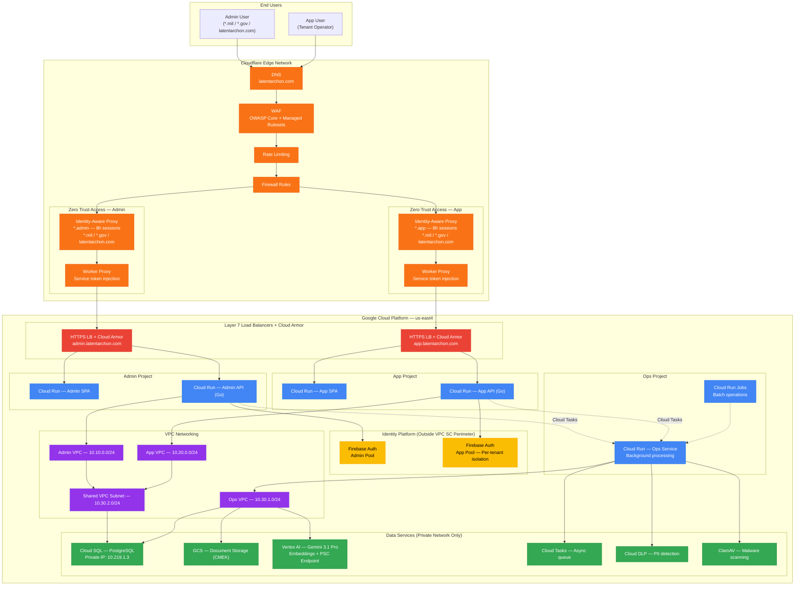

# Network Traffic Flow — Production Architecture (Portrait)

```mermaid
flowchart TB
    subgraph users["End Users"]
        direction TB
        admin_user["Admin User<br/>(*.mil / *.gov / latentarchon.com)"]
        app_user["App User<br/>(Tenant Operator)"]
    end

    subgraph cf_edge["Cloudflare Edge Network"]
        direction TB
        dns["DNS<br/>latentarchon.com"]
        waf_cf["WAF<br/>OWASP Core + Managed Rulesets"]
        rate["Rate Limiting"]
        fw["Firewall Rules"]

        subgraph zt_admin["Zero Trust Access — Admin"]
            access_admin["Identity-Aware Proxy<br/>*.admin — 8h sessions<br/>*.mil / *.gov / latentarchon.com"]
            worker_admin["Worker Proxy<br/>Service token injection"]
        end

        subgraph zt_app["Zero Trust Access — App"]
            access_app["Identity-Aware Proxy<br/>*.app — 8h sessions<br/>*.mil / *.gov / latentarchon.com"]
            worker_app["Worker Proxy<br/>Service token injection"]
        end
    end

    subgraph gcp["Google Cloud Platform — us-east4"]
        direction TB
        subgraph lb_layer["Layer 7 Load Balancers + Cloud Armor"]
            direction TB
            lb_admin["HTTPS LB + Cloud Armor<br/>admin.latentarchon.com"]
            lb_app["HTTPS LB + Cloud Armor<br/>app.latentarchon.com"]
        end

        subgraph compute_admin["Admin Project"]
            direction TB
            cr_admin_spa["Cloud Run — Admin SPA"]
            cr_admin_api["Cloud Run — Admin API (Go)"]
        end

        subgraph compute_app["App Project"]
            direction TB
            cr_app_spa["Cloud Run — App SPA"]
            cr_app_api["Cloud Run — App API (Go)"]
        end

        subgraph auth["Identity Platform (Outside VPC SC Perimeter)"]
            direction TB
            idp_admin["Firebase Auth<br/>Admin Pool"]
            idp_app["Firebase Auth<br/>App Pool — Per-tenant isolation"]
        end

        subgraph networking["VPC Networking"]
            direction TB
            vpc_admin["Admin VPC — 10.10.0.0/24"]
            vpc_app["App VPC — 10.20.0.0/24"]
            shared["Shared VPC Subnet — 10.30.2.0/24"]
            vpc_ops["Ops VPC — 10.30.1.0/24"]
        end

        subgraph ops["Ops Project"]
            direction TB
            cr_ops["Cloud Run — Ops Service<br/>Background processing"]
            cr_jobs["Cloud Run Jobs<br/>Batch operations"]
        end

        subgraph data["Data Services (Private Network Only)"]
            direction TB
            sql["Cloud SQL — PostgreSQL<br/>Private IP: 10.219.1.3"]
            gcs["GCS — Document Storage (CMEK)"]
            vertex["Vertex AI — Gemini 3.1 Pro<br/>Embeddings + PSC Endpoint"]
            tasks["Cloud Tasks — Async queue"]
            dlp["Cloud DLP — PII detection"]
            clam["ClamAV — Malware scanning"]
        end
    end

    %% User flows
    admin_user --> dns
    app_user --> dns
    dns --> waf_cf
    waf_cf --> rate
    rate --> fw

    %% Admin path
    fw --> access_admin
    access_admin --> worker_admin
    worker_admin --> lb_admin

    %% App path
    fw --> access_app
    access_app --> worker_app
    worker_app --> lb_app

    %% LB to Cloud Run
    lb_admin --> cr_admin_spa
    lb_admin --> cr_admin_api
    lb_app --> cr_app_spa
    lb_app --> cr_app_api

    %% APIs to auth
    cr_admin_api --> idp_admin
    cr_app_api --> idp_app

    %% APIs to VPCs
    cr_admin_api --> vpc_admin
    cr_app_api --> vpc_app

    %% APIs dispatch work to Ops via Cloud Tasks
    cr_admin_api -.->|"Cloud Tasks"| cr_ops
    cr_app_api -.->|"Cloud Tasks"| cr_ops

    %% Shared VPC
    vpc_admin --> shared
    vpc_app --> shared
    shared --> sql

    %% Ops networking
    cr_ops --> vpc_ops
    cr_jobs -.-> cr_ops

    %% Data tier
    vpc_ops --> sql
    vpc_ops --> gcs
    vpc_ops --> vertex
    cr_ops --> tasks
    cr_ops --> dlp
    cr_ops --> clam

    %% Styling
    classDef edge fill:#f97316,stroke:#ea580c,color:#fff
    classDef gcp_svc fill:#4285f4,stroke:#1a73e8,color:#fff
    classDef data_svc fill:#34a853,stroke:#1e8e3e,color:#fff
    classDef auth_svc fill:#fbbc04,stroke:#f9ab00,color:#000
    classDef network fill:#9333ea,stroke:#7c3aed,color:#fff
    classDef armor fill:#ea4335,stroke:#d93025,color:#fff

    class dns,waf_cf,rate,fw,access_admin,access_app,worker_admin,worker_app edge
    class cr_admin_spa,cr_admin_api,cr_app_spa,cr_app_api,cr_ops,cr_jobs gcp_svc
    class sql,gcs,vertex,tasks,dlp,clam data_svc
    class idp_admin,idp_app auth_svc
    class vpc_admin,vpc_app,vpc_ops,shared network
    class lb_admin,lb_app armor
```
