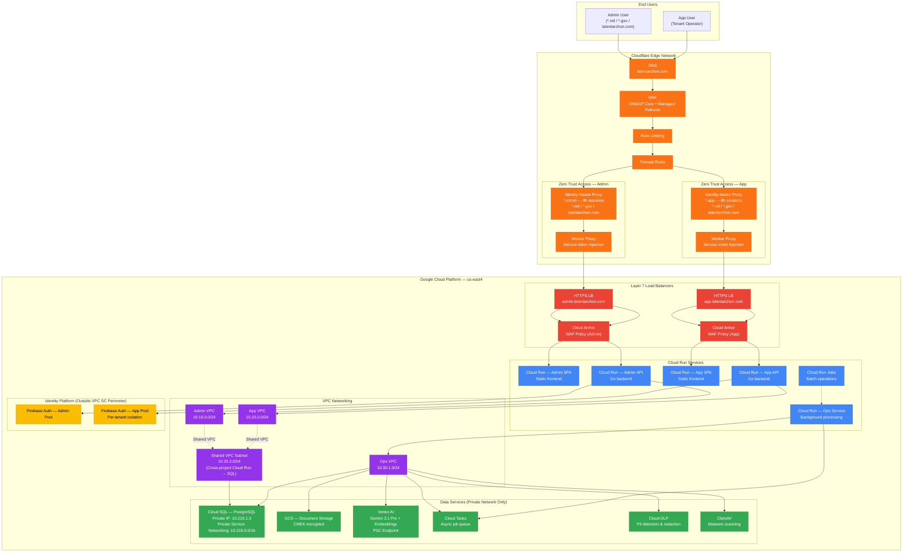

# Network Traffic Flow — Production Architecture

```mermaid
flowchart TB
    subgraph users["End Users"]
        admin_user["Admin User<br/>(*.mil / *.gov / latentarchon.com)"]
        app_user["App User<br/>(Tenant Operator)"]
    end

    subgraph cf_edge["Cloudflare Edge Network"]
        direction TB
        dns["DNS<br/>latentarchon.com"]
        waf_cf["WAF<br/>OWASP Core + Managed Rulesets"]
        rate["Rate Limiting"]
        fw["Firewall Rules"]

        subgraph zt_admin["Zero Trust Access — Admin"]
            access_admin["Identity-Aware Proxy<br/>*.admin — 8h sessions<br/>*.mil / *.gov / latentarchon.com"]
            worker_admin["Worker Proxy<br/>Service token injection"]
        end

        subgraph zt_app["Zero Trust Access — App"]
            access_app["Identity-Aware Proxy<br/>*.app — 8h sessions<br/>*.mil / *.gov / latentarchon.com"]
            worker_app["Worker Proxy<br/>Service token injection"]
        end
    end

    subgraph gcp["Google Cloud Platform — us-east4"]
        subgraph lb_layer["Layer 7 Load Balancers"]
            lb_admin["HTTPS LB<br/>admin.latentarchon.com"]
            armor_admin["Cloud Armor<br/>WAF Policy (Admin)"]
            lb_app["HTTPS LB<br/>app.latentarchon.com"]
            armor_app["Cloud Armor<br/>WAF Policy (App)"]
        end

        subgraph compute["Cloud Run Services"]
            cr_admin_spa["Cloud Run — Admin SPA<br/>Static frontend"]
            cr_admin_api["Cloud Run — Admin API<br/>Go backend"]
            cr_app_spa["Cloud Run — App SPA<br/>Static frontend"]
            cr_app_api["Cloud Run — App API<br/>Go backend"]
            cr_ops["Cloud Run — Ops Service<br/>Background processing"]
            cr_jobs["Cloud Run Jobs<br/>Batch operations"]
        end

        subgraph networking["VPC Networking"]
            vpc_admin["Admin VPC<br/>10.10.0.0/24"]
            vpc_app["App VPC<br/>10.20.0.0/24"]
            vpc_ops["Ops VPC<br/>10.30.1.0/24"]
            shared["Shared VPC Subnet<br/>10.30.2.0/24<br/>(Cross-project Cloud Run → SQL)"]
        end

        subgraph data["Data Services (Private Network Only)"]
            sql["Cloud SQL — PostgreSQL<br/>Private IP: 10.219.1.3<br/>Private Service Networking: 10.219.0.0/16"]
            gcs["GCS — Document Storage<br/>CMEK encrypted"]
            vertex["Vertex AI<br/>Gemini 3.1 Pro + Embeddings<br/>PSC Endpoint"]
            tasks["Cloud Tasks<br/>Async job queue"]
            dlp["Cloud DLP<br/>PII detection & redaction"]
            clam["ClamAV<br/>Malware scanning"]
        end

        subgraph auth["Identity Platform (Outside VPC SC Perimeter)"]
            idp_admin["Firebase Auth — Admin Pool"]
            idp_app["Firebase Auth — App Pool<br/>Per-tenant isolation"]
        end
    end

    %% User flows
    admin_user --> dns
    app_user --> dns
    dns --> waf_cf --> rate --> fw

    %% Admin path — Zero Trust
    fw --> access_admin
    access_admin --> worker_admin --> lb_admin

    %% App path — Zero Trust (mirrors admin)
    fw --> access_app
    access_app --> worker_app --> lb_app

    %% LB to Cloud Armor to Cloud Run
    lb_admin --> armor_admin --> cr_admin_spa
    lb_admin --> armor_admin --> cr_admin_api
    lb_app --> armor_app --> cr_app_spa
    lb_app --> armor_app --> cr_app_api

    %% Cloud Run to VPCs
    cr_admin_api --> vpc_admin
    cr_app_api --> vpc_app
    cr_ops --> vpc_ops

    %% Shared VPC for cross-project SQL access
    vpc_admin -.->|"Shared VPC"| shared
    vpc_app -.->|"Shared VPC"| shared
    shared --> sql

    %% Data tier connections
    vpc_ops --> sql
    vpc_ops --> gcs
    vpc_ops --> vertex
    vpc_ops --> tasks
    vpc_ops --> dlp
    vpc_ops --> clam

    cr_admin_api --> idp_admin
    cr_app_api --> idp_app
    cr_ops --> tasks
    cr_jobs -.-> cr_ops

    %% Styling
    classDef edge fill:#f97316,stroke:#ea580c,color:#fff
    classDef gcp_svc fill:#4285f4,stroke:#1a73e8,color:#fff
    classDef data_svc fill:#34a853,stroke:#1e8e3e,color:#fff
    classDef auth_svc fill:#fbbc04,stroke:#f9ab00,color:#000
    classDef network fill:#9333ea,stroke:#7c3aed,color:#fff
    classDef armor fill:#ea4335,stroke:#d93025,color:#fff

    class dns,waf_cf,rate,fw,access_admin,access_app,worker_admin,worker_app edge
    class cr_admin_spa,cr_admin_api,cr_app_spa,cr_app_api,cr_ops,cr_jobs gcp_svc
    class sql,gcs,vertex,tasks,dlp,clam data_svc
    class idp_admin,idp_app auth_svc
    class vpc_admin,vpc_app,vpc_ops,shared network
    class armor_admin,armor_app,lb_admin,lb_app armor
```
