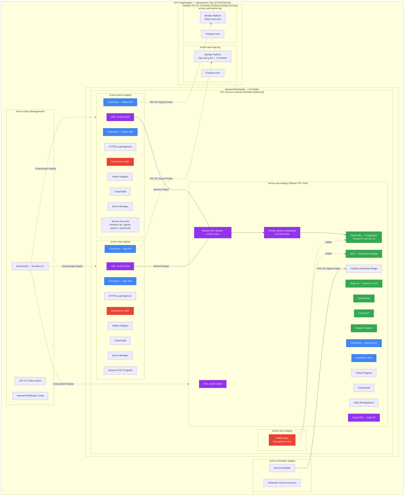

# GCP Project Boundary Architecture — Staging

```mermaid
flowchart TB
    subgraph org["GCP Organization — latentarchon.com (273751541032)"]
        subgraph aw_il5["Assured Workloads — IL5 Folder"]
            subgraph vpcsc["VPC Service Controls Perimeter (Enforced)"]
                subgraph admin_proj["archon-admin-staging"]
                    direction TB
                    admin_vpc["VPC: 10.10.0.0/24"]
                    admin_cr_spa["Cloud Run — Admin SPA"]
                    admin_cr_api["Cloud Run — Admin API"]
                    admin_lb["HTTPS Load Balancer"]
                    admin_armor["Cloud Armor WAF"]
                    admin_ar["Artifact Registry"]
                    admin_cb["Cloud Build"]
                    admin_sm["Secret Manager"]
                    admin_sa["Service Accounts<br/>terraform-sa / github-actions / cloud-build"]
                end

                subgraph app_proj["archon-app-staging"]
                    direction TB
                    app_vpc["VPC: 10.20.0.0/24"]
                    app_cr_spa["Cloud Run — App SPA"]
                    app_cr_api["Cloud Run — App API"]
                    app_lb["HTTPS Load Balancer"]
                    app_armor["Cloud Armor WAF"]
                    app_ar["Artifact Registry"]
                    app_cb["Cloud Build"]
                    app_sm["Secret Manager"]
                    app_vertex_psc["Vertex AI PSC Endpoint"]
                end

                subgraph ops_proj["archon-ops-staging (Shared VPC Host)"]
                    direction TB
                    ops_vpc["VPC: 10.30.1.0/24"]
                    shared_subnet["Shared VPC Subnet: 10.30.2.0/24"]
                    psn["Private Service Networking<br/>10.219.0.0/16"]
                    ops_sql["Cloud SQL — PostgreSQL<br/>Private IP: 10.219.1.3"]
                    ops_gcs["GCS — Document Storage"]
                    ops_vertex["Vertex AI — Gemini 3.1 Pro"]
                    ops_tasks["Cloud Tasks"]
                    ops_dlp["Cloud DLP"]
                    ops_clam["ClamAV Scanner"]
                    ops_cr["Cloud Run — Ops Service"]
                    ops_jobs["Cloud Run Jobs"]
                    ops_ar["Artifact Registry"]
                    ops_cb["Cloud Build"]
                    ops_atlas["Atlas DB Migrations"]
                    ops_pubsub["Pub/Sub Scheduler Bridge"]
                    ops_nat["Cloud NAT — Static IP"]
                end

                subgraph kms_proj["archon-kms-staging"]
                    direction TB
                    kms_keys["CMEK Keys<br/>Encryption at rest"]
                end
            end
        end

        subgraph auth_outside["Outside VPC SC Perimeter (Firebase Global Services)"]
            subgraph auth_admin_proj["archon-auth-admin-stg"]
                direction TB
                auth_admin_idp["Identity Platform<br/>Admin user pool"]
                auth_admin_fb["Firebase Auth"]
            end

            subgraph auth_app_proj["archon-auth-app-stg"]
                direction TB
                auth_app_idp["Identity Platform<br/>App user pool — 12 tenants"]
                auth_app_fb["Firebase Auth"]
            end
        end

        subgraph sched_proj["archon-scheduler-staging"]
            direction TB
            sched_cs["Cloud Scheduler"]
            sched_sa["Scheduler Service Accounts"]
        end

        subgraph mgmt["archon-mgmt (Management)"]
            direction TB
            mgmt_cb["Cloud Build — Terraform CI"]
            mgmt_vpcsc["VPC SC Policy Admin"]
            mgmt_aw["Assured Workloads Config"]
        end
    end

    %% Shared VPC relationships
    admin_vpc ---|"Service Project"| shared_subnet
    app_vpc ---|"Service Project"| shared_subnet
    shared_subnet --> psn --> ops_sql

    %% VPC SC egress to auth
    admin_cr_api -.->|"VPC SC Egress Policy"| auth_admin_idp
    app_cr_api -.->|"VPC SC Egress Policy"| auth_app_idp

    %% KMS encryption
    kms_keys -.->|"CMEK"| ops_sql
    kms_keys -.->|"CMEK"| ops_gcs

    %% Scheduler to Pub/Sub
    sched_cs -->|"VPC SC Ingress Policy"| ops_pubsub

    %% Management CI
    mgmt_cb -.->|"Cross-project deploy"| admin_proj
    mgmt_cb -.->|"Cross-project deploy"| ops_proj
    mgmt_cb -.->|"Cross-project deploy"| app_proj

    %% Styling
    classDef perimeter fill:#e8eaf6,stroke:#3f51b5,stroke-width:3px
    classDef il5 fill:#e8f5e9,stroke:#2e7d32,stroke-width:3px
    classDef auth_zone fill:#fff3e0,stroke:#ef6c00,stroke-width:2px
    classDef project fill:#e3f2fd,stroke:#1565c0,stroke-width:2px
    classDef data fill:#34a853,stroke:#1e8e3e,color:#fff
    classDef compute fill:#4285f4,stroke:#1a73e8,color:#fff
    classDef security fill:#ea4335,stroke:#d93025,color:#fff
    classDef network fill:#9333ea,stroke:#7c3aed,color:#fff

    class ops_sql,ops_gcs,ops_vertex,ops_tasks,ops_dlp,ops_clam data
    class admin_cr_spa,admin_cr_api,app_cr_spa,app_cr_api,ops_cr,ops_jobs compute
    class admin_armor,app_armor,kms_keys security
    class admin_vpc,app_vpc,ops_vpc,shared_subnet,psn,ops_nat network
```
